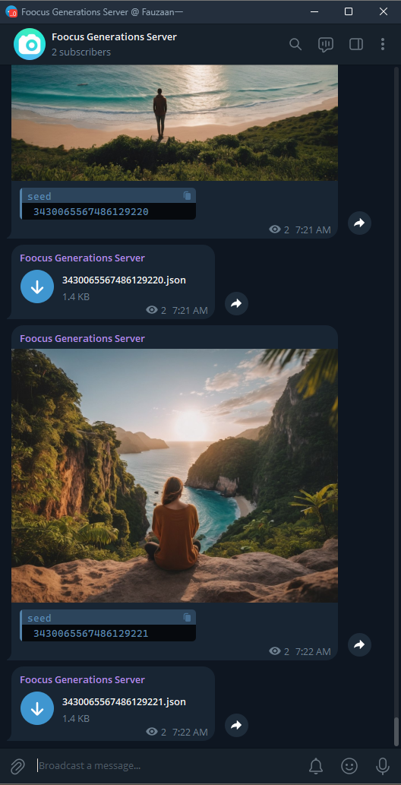

# 📷 Fooocus Telegram Bot

## 🤔 Why use this

### 📱 **Enhanced Mobile Experience**
- **Problem**: When using Fooocus from a mobile device, the connection drops when the browser loses focus. This disconnect makes it impossible to retrieve images directly on mobile.
- **Solution**: This script sends images to Telegram, ensuring you receive your generated images without staying connected to the server.

### 💾 **Efficient Storage Management**
- **Problem**: Your PC storage can quickly fill up with generated images you don't need.
- **Solution**: By sending images to Telegram, which works across all devices and never deletes files, you keep your PC storage clean and manage your outputs better.

### 🌐 **Universal Access**
- **Convenience**: Access your images anytime, anywhere via Telegram without manually transferring files. Telegram ensures your files are safely stored and accessible from any device.
- **Shared Foocus**: If you perheps makes the server public, (within homenetwork or even online), this could enhance the experience for other users who use it via mobile as well.

> Had an itch, so I scratched it. 🤷‍♂️

## 🌟 Features

1. **Monitor Output Path**: Watches for new images in the Fooocus output directory.
2. **Send to Telegram**: Automatically sends images to your Telegram chat or channel.
3. **Share Styles JSON**: Sends a styles JSON file to recreate the image (default name is the image seed).
4. **Clean Up**: Deletes the image and log file from the output path after sending.

## 📋 Requirements

1. **Fooocus Config**: Ensure metadata is enabled.
2. **Telegram Bot Token**: Needed to send messages.
3. **Telegram Chat ID**: Specify the chat or channel to send images.
4. **Python Environment**: Separate from Fooocus recommended (untested with shared env).

## 🛠 Future Improvements

- Telegram-based management of Fooocus
- Load new presets and styles automatically
- Full interaction with Fooocus via Telegram

## 🎨 Usage

Run the script alongside the Fooocus server to enjoy a seamless mobile experience. You can use create-bat.py to generate
a Windows batch file for easy startup. You can place this batch file in the same directory as the fooocus batch files.
